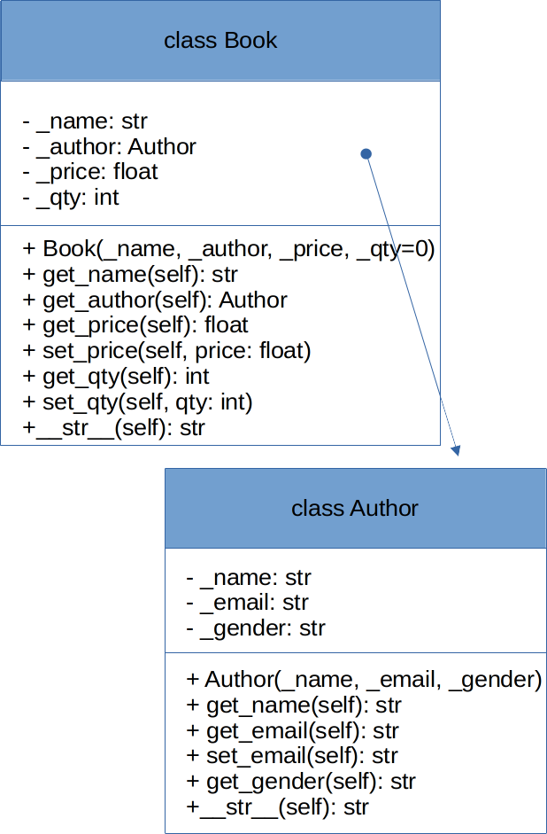
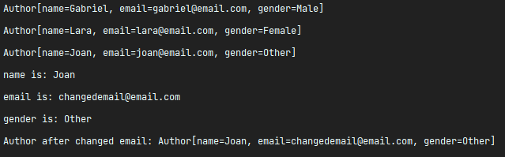
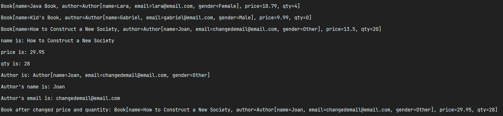

# Encapsulation - Books and Authors


**DO NOT CHANGE ANYTHING IN THE src/tests folder without permission**

In this exercise, we'll be visiting encapsulation, along with composition. We'll be creating a few
classes as described below:

> **Hint:** Composition is the term used for a **HAS-A relationship** between classes.
---

Take a look at the diagram of the Book and the Author classes:



## Author Class

You should write the Author class as shown in the class diagram. The class is designed to model a
book's author. it contains:

1. **Three private instance variables**: `name` (str), `email` (str), and `gender` (str of
   either 'Male' or 'Female').;

> **Bonus:** Make _**gender**_ an **Enum** instead and add non-binary gender values as you will.

2. **The constructor** to initialize the name, email and gender with the given
   values `Author (str name, str email, str gender) {......}`

3. **Public** methods to get and set attributes: `get_name()`, `get_email()`, `set_email()`, and `get_gender()`;

> **Hint:** (There are no methods to set **name** and **gender**, as these attributes cannot be
> changed). Thus, you can also mark them **final**.

4. A `__str__(self)` method that returns **Author[name=?,email=?,gender=?]**, e.g., `Author
   [name=Aloe Vera, email=isthisanemail@somewhere.com,gender=m]`.

> **Hint:** The __str__(self) method of a class is automatically used whenever turning the class instance
> into a string. It has a default way of displaying it, but by overriding it, you can achieve a different
> result.
---

## Book Class


You should write the Book class as shown in the class diagram. The class is designed to model a book
written by an author. It contains:

1. **Four private instance variables**: `_name` (str), `_author` (of the class Author you have just
   created), `_price` (float), and `_qty` (int);

2. The constructor:

`Book (str _name, Author _author, float _price, int _qty=1) { ...... }`\

3. **Public methods** `get_name()`, `get_author()`, `get_price()`, `set_price()`, `get_qty()`, `set_qty()`
   .

4. A `__str__(self)` method that returns `Book[name=?,Author[name=?,email=?,gender=?],price=?,qty=?`. You
   should **reuse** Author’s `__str__(self)` here.

> **Hint:** Take note that **both** **Book** and **Author** classes have a variable called `name`. However, it
> can be differentiated via the referencing instance. For a Book instance, say `a_book`, `a_book.name`
> refers to the name of the book; whereas for an Author's instance, say `au_author`, `an_author.name`
> refers to the name of the author. **There is no need (and it's not recommended)** to call the
> variables `book_name` and `author_name`.

---

## BookTest Class

Now that both our Author and Book classes are created, it's time to use them!

Head to the BookTest class. This class contains our **main method**.

Create a few instances of the Author class. They'll be printed on the console once you run the main
method.

In one of the instances, we'll call the set_email() method to change the value of the email, and then
we'll print it again. See how the value of the email changes?

You should see a result similar to this:



Now you should also create books instances. Create a few of them and associate the previously
created authors to them.

In one of the instances, we'll be changing the price and the quantity through their respective
setter methods. You can see how the changes will be stored in the object instance.

You should get a result similar to this:



---

## Results

With this, you can see how we achieved encapsulation. We aggregated states (attributes) and behaviors (
methods) together in a single place: a class. You can see that each class created is responsible to
manage its state, and no one else but itself, through its methods. With encapsulation, we can indicate
that no other class should modify the state of a class, and outside classes should only do what a
given class indicates it should do.

## Extra:
Now that you understand encapsulation a bit more, go back to our BookTest class and spot the
following lines of code:

```py
print("Author's name is: " + book3.get_author().get_name())
print("Author's email is: " + book3.get_author().get_email())
```

You see how we get the author's name and email? We have to navigate to the author's instance
that linked to the book and then retrieve them. Now, reflect about this:

#### Does it make sense that the Book class can retrieve those values directly?

The answer is: **depends!** On what? On our requirements. Make the next question:

#### Is this an attribute (name, email) that is commonly requested from outside classes that are using the Book class?

If the answer is **yes**, then it probably makes sense.

Then, with no further due, you can put create new methods in the Book class and move
these lines to it. Then it should look like this:

```py
print("Author's name is: " + book3.get_author_name())
print("Author's email is: " + book3.get_author_email())
```

By doing this, we're adding more functionality to the Book class - one that is **within its
scope** - to retrieve its own author's name and email.
