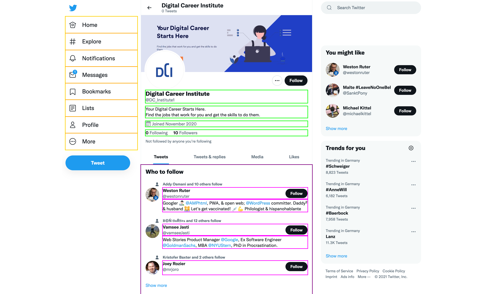

# Task - Template Data Structure

When developing user interfaces you often make use of template languages. Template languages are subsets of the programming language they are implemented in and limit their functionality to things like control structures. They have limited functionality, but really concise and clear syntax.

See this Python code and the Jinja2 code (a Python template engine) in comparison to make it more clear:

```python
name = 'Paul'
```

```python
print('<html>')
print('  <body>')
print('    <p>' + name + '</p>')
print('  </body>')
print('</html>')
```

In comparison this is the Jinja2 code for the same HTML document:

```jinja2
<html>
  <body>
    <p>{{ name }}</p>
  </body>
</html>
```

Templates expect a *context*. In almost all cases that is a single dictionary that holds all data you want to use in a template. Preparing this context needs to be done thoughtfully to not push data around you won't even use in the template.

Have a look at the provided website layout below and try to structure the data in a nested dictionary. 



In the image above, try to use colored lines to group related data in dictionaries. Only this data is relevant for this exercise. You might also want to use lists for things like bullet points or navigation items.

To give you an example, start with the following structure:

```python
context = {
  'navigation': [
    'Home',
    'Explore',
    ...
  ]
}
```
