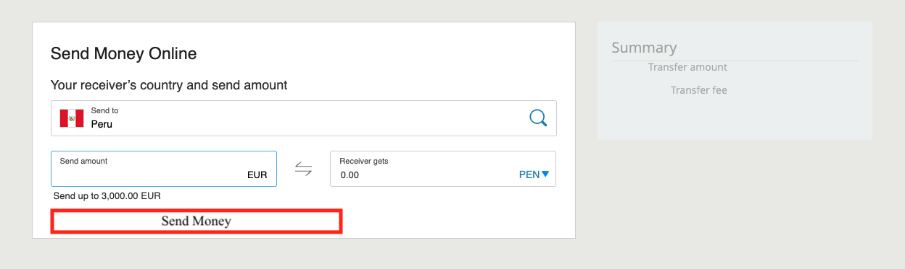

## Design a money transfer service for students (Django Project)

Every week as students we feel very generous and like to send other 
colleagues and friends money for a beverage. 

These friends of ours live in other countries. We as developers are required to 
design a form where we choose a country (origin) and a destination country from a list of countries in the world.

After submitting the form, it should tell us what the rate will be for the Origin country to destination country, show the value in another url/page called "results".

For example:

EUR to PESOs, EUR to USD, EUR to SEK, etc.

Hints
- Is there a module you could use in Python with a list of countries
- Can we calculate the forex rate using an API like https://pypi.org/project/forex-python/ ?

What to do?
- Create at least 1 application (no models are expected)
- Create at least 2 templates: 1 for the form and another to show the results of a conversion

Design mock (It should look closer to this, do not worry about reaching the exact design)

