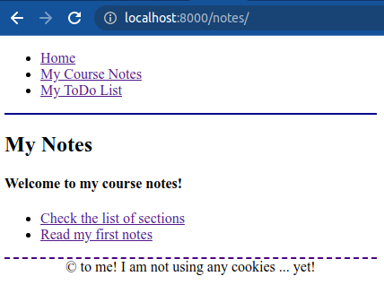
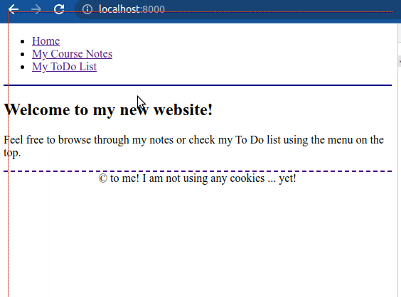

# Django Views and Templates

## Description

In this exercise, we will improve our views and will use templates to remove the data and user interface from our them, conforming better to the MVC design pattern.

## Initial Data

Use the Django project you started in the exercise about [Django and URLconf](https://github.com/dci-python-course/Python-basics-django-urls).

If you wish, you can  use the [solution provided](https://github.com/dci-python-course/Python-basics-django-urls/tree/solution_task8/solution/course) at the end of that exercise.

> If you do so, make sure your virtual environment has all the necessary dependencies by moving into the `course` directory and typing:
>
> `(env) $ pip install -r requirements.txt`

## Tasks

### Task 1

Start by creating a new page on the root of the project's website (http://localhost:8000/).

But to do this page, first, create a template named `base.html` that will be used as a general template with the elements common to all of our views (from any Django app).

On this file, you will define the general HTML structure (with the HTML elements html, head, title, body,...). You will also have to create a general menu that will be shown on every view. This menu will have two links: one to the `notes` app and the other one to the `todo` app.

You can also define a footer common to all views.

In the middle, add a block so that your views can extend the `base.html` and replace the main content area with the view's content.

Once you have your `base.html`, create the path and view for the home. The view should be a `TemplateView` and will be using a template named `home.html` that will extend the `base.html` created earlier, and which content will be a simple welcoming message.

> Tip: you can create a view that extends TemplateView or you can skip the view and use `TemplateView.as_view(template_name='your/path')` directly in your path definition.
>
> Do not forget to add your apps to the settings.INSTALLED_APPS option so that Django can find the templates automatically.

**Once you are done, go to http://localhost:8000/ and you should see something similar to this:**


### Task 2

Now that you have a home page that uses extended templates, it is time to adapt the rest of the views so that they don't contain any HTML.

Since the notes app has a few views you will start by defining a second `base.html`, this time only for the views in the `notes` app. This template will extend the `common/base.html` template and will add to the block `content` an `h1` header with the text `My Notes`.

We want this header to be visible at all times when the visitor navigates through any of the views in the notes app.

> The `My Notes` header should appear in every view that uses this template, without us having to write this header in every view.

Then, refactor the notes home view. Leave this view as a function and use `get_template` to get the template and then render it with your context data.

Finally, add another link to your `common/base.html` menu, pointing to the root of the website.

**When done, go to http://localhost:8000/notes/ and you should see something similar to this:**



### Task 3

Now, refactor the two views related to sections: the sections list and the list of notes in a section.

Use class-based views for this task and create templates that extend the `notes/base.html` template (keeping the app header `My Notes`).

**Once you are done with the changes your website should look similar to this:**


### Task 4

Finally, refactor the **note details view** and the **search results view** in the same way.

For the **note details view** use the following view and work on the template to make the navigational links work properly.

```python
class NoteDetails(TemplateView):
    """Note details."""

    template_name = "details.html"

    def get_context_data(self, note_id):
        """Return the note data."""
        return {
            "id": note_id,
            "num_notes": len(notes),
            "note": notes[note_id - 1]
        }
```
> **Notice**: Pay attention to the last note in the list. Its contents should show like this:
>
> `Parameters passed with the < and > will be passed as keyword arguments.`
>
> And not like this:
>
> `Parameters passed with the <b><</b> and <b>></b> will be passed as keyword arguments.`
>
> **Hint**: you may have to use some filters.

For the **search results view**, use the following code and work on the template to perform the search.

```python
class SearchResultsView(TemplateView):
    """Execute the search and show results."""

    template_name = "search.html"

    def get_context_data(self, search_term):
        """Return the term and list of notes."""
        return {
            "notes": notes,
            "term": search_term
        }
```

**Once you are done, your website should look similar to this:**


### Task 5

Finally, we have noticed that the section name in the **note details view** could also be a link to the **notes by section view** of that particular section. And the search results should also show which section each note belongs to and should have the same link.

Instead of adding that link manually everywhere, define a custom filter named `linkable_section`.

This filter will transform the original text value into an HTML string with an `a` HTML element pointing to the correspondig view.

Use this new filter in your `details.html`, `sections.html` and `search.html` templates every time you show the section name.

**Once you are done the website should work as it was working before and a new link in the search results view appears pointing to each note's section.**



### Task 6

Now, add some simple styling to your site. The task is not to create a complex and beautiful style, but to place these styles in a separate file `styles.css` and link them properly to your template, so don't worry too much about the CSS rules.

> If you already have some minimal styling in the `head` section of your template, you can use that one.
>
> Or you can mimic the examples shown so far, and use some simple border for the header and the footer.

**Once you are done, no CSS code should be present in any file other than the `style.css`.**
